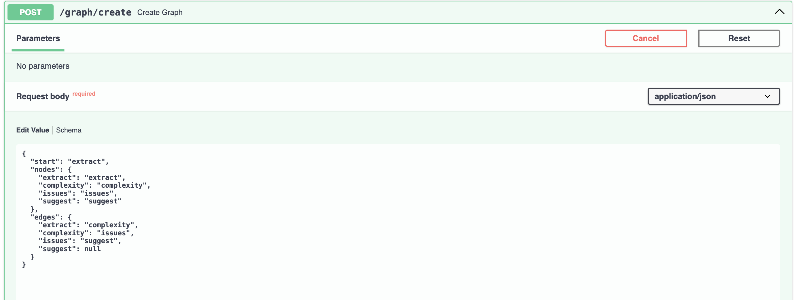
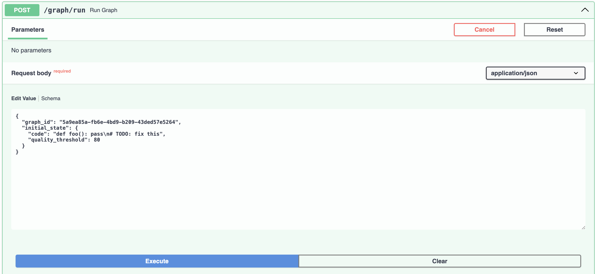

# Graph-Based Code Analysis API

A FastAPI application that provides a graph-based workflow system for code analysis.

## Installation

1. Create a virtual environment:
```bash
python -m venv venv
source venv/bin/activate  # On Windows: venv\Scripts\activate
```

2. Install dependencies:
```bash
pip install -r requirements.txt
```

## Running the Application

```bash
uvicorn main:app --reload
```

The API will be available at `http://localhost:8000`

## Using the API

Visit `http://localhost:8000/docs` to access the interactive API documentation (Swagger UI) where you can test all endpoints directly.

## API Endpoints

### 1. Create Graph Workflow

`POST /graph/create` - Create a new graph workflow



**Example Response:**


### 2. Run Graph Workflow

`POST /graph/run` - Execute a graph workflow



**Example Response:**


### 3. Get Run State

`GET /graph/state/{run_id}` - Get the state of a workflow run

**Example Response:**


## Available Node Functions

- `extract` - Extract functions from code
- `complexity` - Compute code complexity
- `issues` - Detect code issues
- `suggest` - Generate suggestions based on analysis

## What Would Be Improved With More Time

1. **Persistence**: Add database storage for graphs and runs instead of in-memory storage
2. **Error Handling**: More robust error recovery and retry mechanisms
3. **Validation**: Enhanced input validation and schema checking for graph definitions
4. **Testing**: Comprehensive unit and integration tests
5. **Performance**: Async optimizations and caching for repeated operations
6. **Monitoring**: Add logging, metrics, and observability
7. **Graph Visualization**: API endpoint to visualize graph structure
8. **Node Library**: Expandable registry of node functions with plugin support
9. **State Management**: Version control for state snapshots and rollback capabilities
10. **Documentation**: OpenAPI schema improvements and more detailed examples